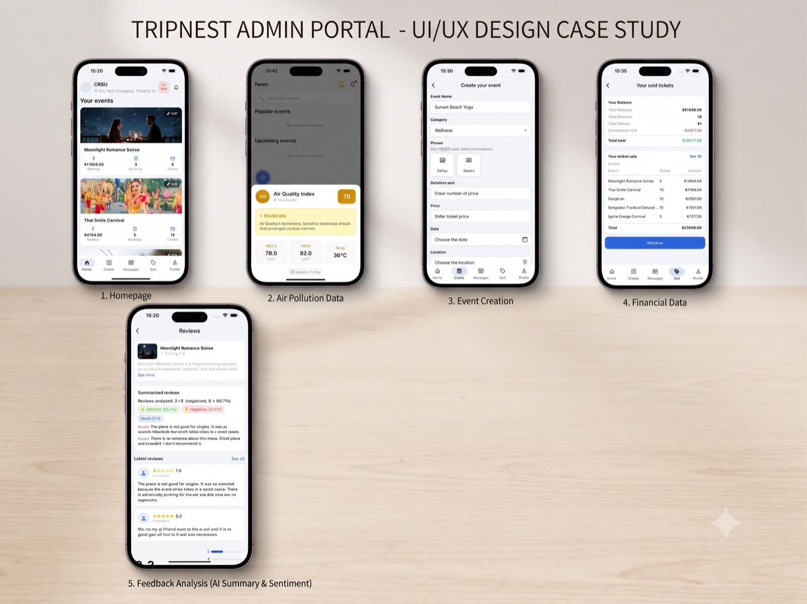

# TripNest Admin

A Flutter mobile app for event **organizers**. TripNest Admin is the operator-side companion to the TripNest platform: organizers create and edit events, track revenue and ticket sales, chat with attendees, read AI-summarized review sentiment, and get air-quality alerts for their area.



## Features

### Events
- Create events with title, description, mood/category, date, location, capacity, and price
- Attach up to multiple photos; images are auto-compressed client-side to ≤300 KB each to fit the server upload limit
- Edit existing events in place (the same page handles create and edit via an `eventId` argument). Photos are read-only while editing — `PATCH /events/:id` carries no image payload, so the picker is hidden rather than silently discarding the selection
- Mood categories: Relaxed, Excited, Adventurous, Romance, Energetic, Cultural, Fun, Festival

### Dashboard
- Per-event revenue, booking count, and ticket count on the home feed
- Pull-to-refresh, with automatic refresh when returning to the Home tab

### Sales & payouts
- Aggregate balance view: gross ticket revenue, 15% platform commission, net total
- Per-event sales breakdown table
- Withdraw button (UI only — not wired to an endpoint yet)

### Feedback analysis
- Fetches reviews per event plus a server-side AI **sentiment summary**
- Positive / negative / neutral distribution, extracted issue highlights, star-rating breakdown, and the latest individual reviews

### Messaging
- Per-event chat rooms with attendees
- Message list, thread view, send messages
- Unread badge on the bottom navigation bar

### Air quality
- Live AQI, PM2.5, and PM10 from the [WAQI](https://waqi.info/) feed API, with a derived level (Good → Hazardous)
- Readings come from WAQI's `here` endpoint, i.e. **IP-based geolocation of the device** — not the location field of any event. On a VPN or carrier NAT this can report a different city
- Local notification on the first check each day, or whenever PM2.5 moves by ≥0.5 µg/m³ since the last reading
- AQI badge surfaced in the home header

### Account
- Onboarding carousel, sign up, log in, forgot password, change password
- Organizer profile (organization name, contact number, address)
- Notification preferences (master switch, sound, vibrate) and security settings (remember password, Face ID, biometric toggles — persisted only; see Configuration Notes)
- Security preferences are reset on deliberate logout only — a transient 401 clears the session without touching the user's toggles
- Privacy policy and help center pages

### Notifications
- In-app notification feed backed by local storage (last 50 retained)
- Native device notifications on iOS and Android; tapping one opens the feed

## Tech Stack

| Area | Choice |
| --- | --- |
| Framework | Flutter (Dart SDK `>=2.18.0 <4.0.0`) |
| UI | Material 3, custom light theme in `lib/main.dart` |
| Networking | `http` — REST against `https://tripnestbackend-v2.onrender.com/api` |
| Auth | JWT bearer token, persisted with `shared_preferences`; a shared `http.Client` redirects to login on any 401 |
| Local storage | `shared_preferences` |
| Notifications | `flutter_local_notifications` |
| Media | `image_picker`, `image`, `path_provider`, `path` |
| Air quality | WAQI feed API (`api.waqi.info`) |

State is managed with plain `StatefulWidget` + `ChangeNotifier` (`MessageNotifier`) — no external state-management package.

## Project Structure

```
lib/
├── main.dart                        # Entry point, theme, named routes
└── src/
    ├── app_shell.dart               # Bottom-nav shell: Home / Create / Messages / Sell / Profile
    ├── core/
    │   ├── services/
    │   │   ├── api_service.dart      # All TripNest REST calls
    │   │   ├── auth_storage.dart     # Token + user persistence, Authorization header
    │   │   ├── session.dart           # Shared HTTP client; expires session on 401
    │   │   ├── air_quality_service.dart
    │   │   ├── chat_service.dart
    │   │   ├── notification_service.dart          # Local + native notifications
    │   │   ├── notification_settings_service.dart # Notification preference toggles
    │   │   └── security_service.dart              # Biometric / remember-password prefs
    │   ├── theme/app_colors.dart
    │   └── widgets/                  # Shared inputs, buttons, settings tiles
    └── features/
        ├── splash/                   # Route entry
        ├── onboarding/
        ├── auth/                     # login, sign_up, forgot_password
        ├── home/                     # Dashboard feed + AQI badge
        ├── create/                   # Create & edit event
        ├── messages/                 # Room list + chat thread
        ├── sales/                    # Balance, commission, sales table
        ├── reviews/                  # Reviews + AI sentiment summary
        ├── notifications/            # Notification feed
        └── profile/                  # Profile, personal data, security, settings, policy, help
```

## API

Base URL: `https://tripnestbackend-v2.onrender.com/api` (`ApiService.baseUrl`, `ChatService.baseUrl`)

All authenticated calls send `Authorization: Bearer <token>`.

| Method | Endpoint | Purpose |
| --- | --- | --- |
| POST | `/auth/register` | Sign up |
| POST | `/auth/login` | Log in |
| POST | `/auth/logout` | Log out |
| POST | `/auth/change-password` | Change password |
| POST | `/auth/forgot-password` | Request reset link |
| GET | `/user/profile` | User profile |
| GET | `/organizers/me` | Organizer profile |
| POST | `/organizers` | Create / update organizer profile |
| GET | `/dashboard/revenue` | Revenue, booking, ticket totals |
| GET | `/dashboard/events` | Per-event revenue breakdown |
| GET | `/events` | Organizer's events |
| GET | `/events/:id` | Single event |
| POST | `/events` | Create event (multipart, image upload) |
| PATCH | `/events/:id` | Update event |
| GET | `/reviews/event/:id` | Reviews for an event |
| GET | `/sentiment/organizer/events/:id/summary` | AI sentiment summary |
| GET | `/sentiment/organizer/events/:id/reviews` | Per-review sentiment labels |
| GET | `/chat/rooms` | Chat rooms |
| GET | `/chat/rooms/:id/messages` | Messages in a room |
| POST | `/chat/rooms/:id/messages` | Send a message |

## Getting Started

### Prerequisites

- Flutter SDK on a channel supporting Dart `>=2.18.0 <4.0.0`
- Xcode (iOS) and/or Android Studio (Android)
- CocoaPods for iOS builds

### Install

```bash
flutter pub get
```

For iOS, install the pods from the `ios/` directory:

```bash
cd ios && pod install
```

### API keys

`lib/src/core/config/api_config.dart` holds third-party keys and is git-ignored,
so a fresh clone has to create it:

```dart
/// API keys for third-party services.
class ApiConfig {
  ApiConfig._();

  // --- WAQI air quality (https://aqicn.org/data-platform/token/) ---
  static const String waqiApiToken = 'PASTE_YOUR_WAQI_TOKEN_HERE';
  static const String waqiBaseUrl = 'https://api.waqi.info/feed';

  /// True when the WAQI token is still a placeholder.
  static bool get isWaqiTokenMissing =>
      waqiApiToken.isEmpty || waqiApiToken.startsWith('PASTE_YOUR_');
}
```

A free WAQI token comes from https://aqicn.org/data-platform/token/. Without it
the air quality card is skipped rather than failing the build.

### Run

```bash
flutter run                          # first available device
flutter run -d "iPhone 17 Pro Max"   # named simulator
```

### Build

```bash
flutter build apk                    # Android
flutter build ios                    # iOS device (requires code signing)
flutter build ios --simulator        # iOS simulator, no signing needed
```

### Test and analyze

```bash
flutter test
flutter analyze
```

`analysis_options.yaml` pulls in `package:flutter_lints`, so `flutter analyze` is meaningful — keep it clean.

The suite covers the session/401 layer (token-scoped expiry, concurrent 401s, the redirect), `ApiService.logout` across success, 401, non-JSON 502, network failure, and no-token, plus the AQI band boundaries and notification serialization. HTTP is mocked throughout via `package:http/testing.dart`, so no backend is required.

### iOS signing

The bundle identifier is still the Flutter template default, `com.example.tripnest1`. Before building for a physical device, change it under **Runner target → Signing & Capabilities → Bundle Identifier** in `ios/Runner.xcworkspace` and select your development team. A device must be registered with your Apple Developer team for automatic provisioning to succeed.

iOS plugins are wired through **Swift Package Manager**. Enable it once per machine before building:

```bash
flutter config --enable-swift-package-manager
```

## Configuration Notes

- **Backend URL** is hardcoded in `ApiService.baseUrl` and `ChatService.baseUrl`. Change both when pointing at another environment.
- **WAQI API token** is currently hardcoded in `lib/src/core/services/air_quality_service.dart`. Move it to `--dart-define` or a git-ignored config before making this repository public.
- **Commission rate** is a fixed 15% computed on the client in `lib/src/features/sales/sales_page.dart`.
- **Biometric toggles** in `SecurityService` only persist preferences; actual biometric authentication (`local_auth`) is not wired up yet.
- **Notification toggles** are honoured for delivery: the master switch suppresses native notifications entirely, and the sound/vibrate toggles feed the platform notification details. The remaining four toggles (offers, payments, cashback, app updates) have no corresponding notification type in the app yet. Feed entries are always recorded — muting silences delivery, not history.

## Session Handling

Authenticated requests go through `apiClient` in `lib/src/core/services/session.dart`, a `BaseClient` wrapper. A 401 clears stored credentials and pushes `/login` with the back stack cleared, so an expired token cannot leave the user on a dashboard where every panel fails.

Three details worth knowing:

- **Expiry is scoped to the token that failed.** The `Authorization` header is captured before the round trip and compared against what is stored when the 401 comes back. Dart's `http` has no cancellation, so a request still in flight from a previous session can resolve *after* the user logs back in; without this check it would evict the new, valid token.
- **A missing navigator is handled.** If the 401 lands before `MaterialApp` is attached, credentials are still cleared and the next launch starts clean.
- **The redirect is not awaited.** `pushNamedAndRemoveUntil` only completes when the login route is popped, so awaiting it would pin the concurrency guard for as long as the login screen is visible.

Unauthenticated endpoints (`register`, `login`, `forgot-password`) and the two where a 401 means "wrong password" rather than "expired session" (`logout`, `change-password`) go through `ApiService`'s separate `credentialClient`, which has no 401 interception. Both clients are injectable for tests.

The login response's `expiresIn` is not persisted — expiry is detected reactively via 401 rather than checked ahead of time, because the field's format is not documented.

## Startup Sequence

`main()` runs, in order:

1. `AuthStorage.init()` — restores any saved JWT and user record
2. `NotificationService.initialize()` — sets up the local-notifications plugin and requests iOS permissions
3. `AirQualityService.checkAndNotify()` — fires the air-quality check without blocking startup

The app then shows the splash route for ~900 ms, which forwards to the main shell if a saved session exists, or to onboarding otherwise.
